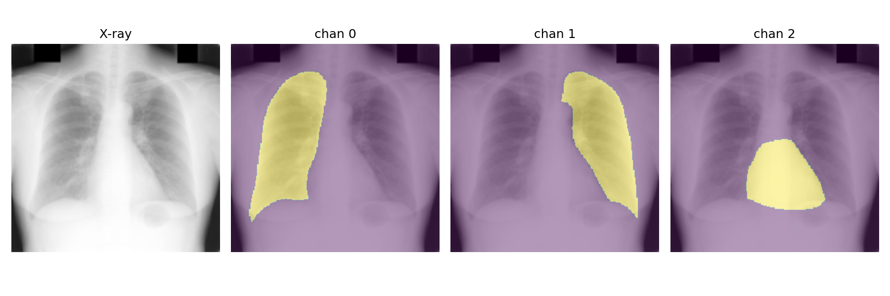
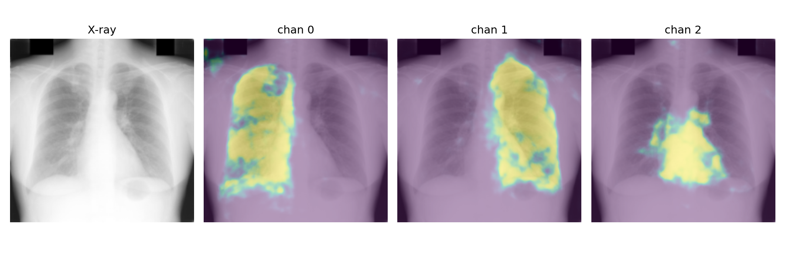

# Data Generation
# Visual Transformer
# CNN_xray Segmentation Model

A **PyTorch‑based** U‑Net style convolutional neural network for multi‑class segmentation of chest X‑ray images into 118 regions.

---

## 📁 Repository Structure

```
.
├── Encoder.py           # ResNet50 backbone encoder
├── ASPP.py              # Atrous Spatial Pyramid Pooling (bottleneck)
├── Decoder.py           # U‑Net style decoder with skip connections + ASPP
├── model.py             # Model assembly / forward pass
├── Loss_function.py     # BCE, Focal Tversky, combo‑loss, etc.
├── metrics.py           # MSE & Dice metrics + per‑class visualization
├── train_full.py        # End‑to‑end training pipeline
├── visual.py            # Post‑training visualization utilities
└── run/vis/             # Example predicted masks
```

---

## 📂 Dataset Layout

```
dataset_root/
├── images/
│   ├── train/
│   │   ├── s0001.png
│   │   ├── s0002.png
│   │   └── …
│   └── val/
│       ├── s0001.png
│       └── …
└── masks/
    ├── train/
    │   ├── s0001.npy
    │   └── …
    └── val/
        ├── s0001.npy
        └── …
```

> **Important:** Image and mask filenames **must match** (`s0001.png` ↔ `s0001.npy`).

---

## 🚀 Quick Start

1. **Configure paths** inside `train_full.py`
```python
DATA_DIR = "/absolute/path/to/dataset_root"
SAVE_DIR = "./checkpoints"
```

2. **Train the model**
```bash
python train_full.py
```

3. **Visualize predictions**
```bash
python visual.py     --model-path checkpoints/best_model.pth     --output-dir run/vis
```

---

## 📊 Best‑so‑far Results

| Metric | Mean | Std‑Dev |
|--------|------|---------|
| **MSE** | **0.056572** | 0.196074 |
| **Dice Coefficient** | **0.725909** | 0.055122 |

---

## 🔍 Sample Outputs

| Mask GT | Model Prediction |
|-----------|----------|
|  |

*(See [`run/vis/`](run/vis/) for more examples.)*

---

## 📄 License

Released under the **MIT License** – see [`LICENSE`](LICENSE) for details.

---

## 🙏 Acknowledgments

* ResNet‑50 weights courtesy of the **TorchVision** model zoo  
